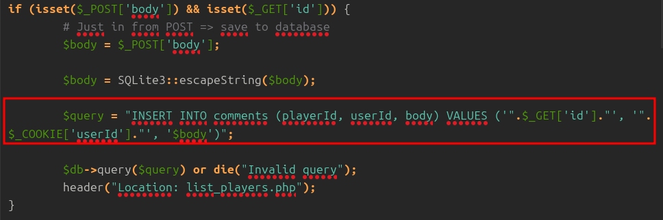
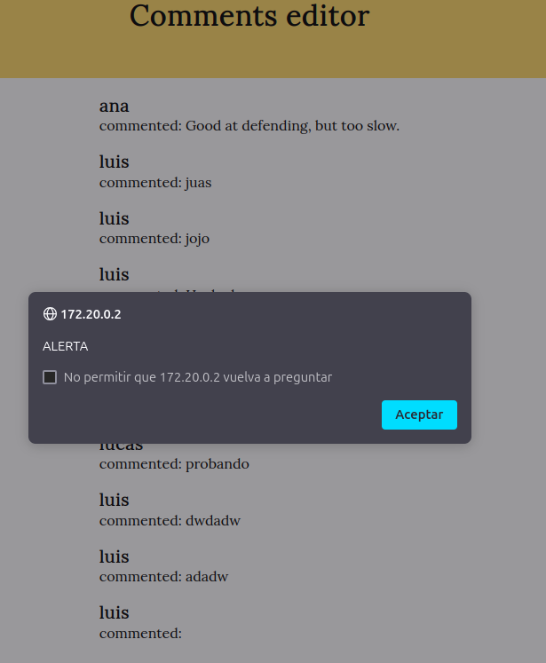

# Proyecto 3 - Web Talent ScoutTech

## Parte 1 - SQLi

**a)** Escribimos comillas dobles en el campo del usuario y nos aparece el siguiente error.


Lo cual nos permite obtener el nombre de los campos de tabla users:

- **userID**
- **password**

También vemos la consulta que ejecuta la página web mediante el archivo auth.php.

```
SELECT userId, password FROM users WHERE username = """
```

No utiliza el campo de password en el formulario para la comprobación, sólo el campo del nombre de usuario.

**b)** Como ya sabemos, los campos de la tabla users, vamos a hacer un **ataque de fuerza bruta** con un diccionario que contiene alguna de las contraseñas más utilizadas aún sin conocer cuantos usuarios registrados hay ni los nombres de estos:

```
password
123456
12345678
1234
qwerty
12345678
dragon
```

Un ataque de fuerza bruta consiste en probar sistemáticamente combinaciones de nombres de usuario y contraseñas hasta encontrar una combinación válida que permita acceder al sistema. Este ataque aprovecha la posibilidad de enviar múltiples solicitudes de autenticación, buscando vulnerabilidades en la configuración del sistema de seguridad.

Haciendo uso de la aplicación de **burpsuite pro** realizaremos este ataque.

Capturamos las peticiones HTTP de la página y abrimos el explorador de **Burpsuite**.


Le damos a *Forward* y escribimos algo de prueba el formulario para poder verlo en la petición HTTP.


Hacemos clic derecho sobre la petición HTTP que hemos capturado y le damos a *Send to Intruder*.


Seleccionamos Cluster Bomb Attack para poder iterar entre las distintas opciones del campo de usuario y la contraseña.

Además, asignamos la posición donde se encuentran dándole a *Auto*.


Para el nombre de usuario, cargamos un diccionario del propio **Burpsuite**.


Por otro lado, para la contraseña, utilizamos el diccionario que se nos proporciona.


Finalmente, hacemos clic en *Start Attack*.


Ordenamos por el tamaño de la respuesta de la petición HTTP y vemos que el usuario *luis* con contraseña *1234* es el que nos da resultados.


**c)** Debido a que en el fichero auth.php de la página se está utilizando la función *SQLite3::escapeString()* para escapar las entradas de usuario, existe una vulnerabilidad en el código.

El problema radica en que no se utiliza de forma segura el insertar los parámetros del usuario. Aunque *escapeString()* escapa caracteres especiales, no es suficiente para proteger completamente la consulta a inyecciones SQL si no se utiliza una consulta preparada.

Entonces, en lugar de concatenar directamente en la consulta SQL, vamos a hacer la siguiente modificación en la función *areUserAndPasswordValid* para usar consultas preparadas con SQLite3:

```
function areUserAndPasswordValid($user, $password) {
global $db, $userId;

$stmt = $db->prepare('SELECT userId, password FROM users WHERE username = :username');
$stmt->bindValue(':username', $user, SQLITE3_TEXT);

$result = $stmt->execute();
$row = $result->fetchArray();

if (!isset($row['password'])) return FALSE;

if ($password == $row['password']) {
    $userId = $row['userId'];
    $_COOKIE['userId'] = $userId;
    return TRUE;
} else {
        return FALSE;
   }
}
```

Usamos *$db->prepare()* para preparar la consulta SQL con un marcador de posición en lugar de insertalo directamente.

Aquí, *:username* es un marcador de posición para el valor que será proporcionado más tarde, lo que impide la inyección SQL.

Luego, usamos *$stmt->bindValue()* para asociar el valor de *\$user* con el marcador de posición :username.

Después de vincular el parámetro, ejecutamos la consulta de forma segura con *$stmt->execute()*.

Finalmente, obtenemos el resultado con *$result->fetchArray()* y comparamos la contraseña proporcionada por el usuario con la almacenada en la base de datos.

Si las contraseñas coinciden, la autenticación es exitosa y se guarda el *userId* en una coockie. Si no coinciden, la función devuelve *FALSE*.

d) Ahora, accedemos con el usuario *luis* con contraseña *1234* y accedemos al archivo *add_comment.php~" el cual es vulnerable; la siguiente sentencia insert de SQL del archivo puede ser vulnerada fácilmente:




Nos dirigimos a add comment y añadimos el siguiente payload en la URL de añadir un comentario a un jugador.

    172.20.0.2/add_comment.php?id=3', 4, 'probando'); --

- La id es el identificador del jugador.
- El 4 es el usuario con el cual escribimos el comentario.
- 'probando' es donde vamos a escribir el comentario.


Esta vulnerabilidad es otra **inyección SQL** sobre la URL de una web, que permite al atacante insertar o manipular comandos SQL como parámetros de URL. En este caso, el atacante puede explotar el parámetro id en la URL para inyectar código malicioso.

Para mitigar y asegurar esta entrada hacemos las siguientes modificaciones en el código:

```
if (isset($_POST['body']) && isset($_GET['id'])) {

 if (!filter_var($_GET['id'], FILTER_VALIDATE_INT)) {
   die("Invalid player ID");
}

 if (!isset($_COOKIE['userId']) || !filter_var($_COOKIE['userId'], FILTER_VALIDATE_INT)) {
   die("Invalid user ID");
}

$body = $_POST['body'];
$playerId = intval($_GET['id']);
$userId = intval($_COOKIE['userId']);

$stmt = $db->prepare("INSERT INTO comments (playerId, userId, body) VALUES (?, ?, ?)");
$stmt->bindValue(1, $playerId, SQLITE3_INTEGER);
$stmt->bindValue(2, $userId, SQLITE3_INTEGER);
$stmt->bindValue(3, $body, SQLITE3_TEXT);

if (!$stmt->execute()) {
	die("Error: Could not insert comment");
}

header("Location: list_players.php");
exit();
}
```

Verificamos que *\$GET['id']* y *\$COOKIE['userId']* sean enteros válidos usando *filter_var*.

También reemplazamos la variables en la consultado SQL por parámetros y usamos *bindValue* para asociar los valores a los parámetros y especificar su tipo.

Si la consulta falla, se detiene la ejecución con un mensaje en pantalla.

## Parte 2 - XSS

**a)** La aplicación es potencialmente vulnerable a XSS (Cross Site Scripting).

Introducimos el siguiente script de JavaScript en el body del mensaje.

    <script>alert('ALERTA');</script>


De esta forma, cada vez que alguien entre en la sección para mostrar los comentarios le aparecerá el siguiente alert:



**b)** El *\&amp;* que aparece en la URL http://www.donate.co/?amount=100&destination=ACMEScouting/
 es el símbolo de "ampersand", que se utiliza en las URLs para separar los parámetros de las consultas en las peticiones GET de la página web.
 
**c)** El problema de `show\_comments.php` es que se permite a un atacante manipular la consultad SQL enviada a la base de datos, comprometiendo la seguridad.

La línea que provoca esta vulnerabilidad es:

```
$query = "SELECT commentId, username, body FROM comments C, users U WHERE C.playerId =".$_GET['id']." AND U.userId = C.userId order by C.playerId desc";
```
Porque el valor de la id se inserta directamente sin validación alguna, así que puede modificarse esa id para ejecutar comandos SQL maliciosos.

Para solucionarlo modificamos la condición del *isset* del parámetro GET y lo dejamos así:

```
if (isset($_GET['id'])) {
    $playerId = intval($_GET['id']);
    
    $stmt = $db->prepare("SELECT commentId, username, body FROM comments C, users U WHERE C.playerId = :playerId AND U.userId = C.userId ORDER BY C.playerId DESC");
    $stmt->bindValue(':playerId', $playerId, SQLITE3_INTEGER); 
    $result = $stmt->execute();
    
    while ($row = $result->fetchArray()) {
        echo "<div>
                <h4>" . htmlspecialchars($row['username']) . "</h4>
                <p>commented: " . htmlspecialchars($row['body']) . "</p>
              </div>";
    }
}

```

Usando la función *prepare()* de nuevo definimos la consulta SQL con un marcador de posición *:playerId*.

Además, validamos la entrada con *intval($GET\['id'])* para asegurarnos que el valor de la id sea un entero.

Ahora, si accedemos a las comentarios de la jugadora Candela, ya no aparecerá la alerta que inyectamos antes.

## Parte 3 - Control de acceso, autenticación y sesiones de usuarios

**a)** La página de `register.php` no es del todo segura, así que vamos a implementar algunas medidas para asegurarlas.

- Saneamos los datos mediante `FILTER_SANITIZE_FULL_SPECIAL_CHARS` para evitar que datos maliciosos sean enviados al servidor y sean ejecutados en el navegador del usuario:

```
$username = filter_var($username, FILTER_SANITIZE_FULL_SPECIAL_CHARS);
$password = filter_var($password, FILTER_SANITIZE_FULL_SPECIAL_CHARS);
```

- Aplicamos un algoritmo de hash seguro a la contraseña, ya que se almacenaba en texto plano:

```
$hashedPassword = password_hash($password, PASSWORD_DEFAULT);
```

- Preparamos una consulta SQL para verificar si el usuario ya existe. Si el usuario ya está registrado, se obtiene el `userId` del usuario correspondiente:

```
$stmt = $db->prepare("SELECT userId FROM users WHERE username = :username");
$stmt->bindValue(':username', $username, SQLITE3_TEXT);
$result = $stmt->execute();
$row = $result->fetchArray();
```

- Si el usuario ya existe, se muestra un mensaje informativo de que ya está registrado en la base de datos. Si no existe, se prepara otra consulta SQL para insertarlo:

```
if ($row) {
	echo "El nombre de usuario ya existe. Elige otro.";
} else {

$stmt = $db->prepare("INSERT INTO users (username, password) VALUES (:username, :password)");
        $stmt->bindValue(':username', $username, SQLITE3_TEXT);
        $stmt->bindValue(':password', $hashedPassword, SQLITE3_TEXT);
        $stmt->execute();
```

### Código completo php de `register.php`:

```
<?php
require_once dirname(__FILE__) . 'conf.php';

if (isset($_POST['username']) && isset($_POST['password'])) {
    $username = $_POST['username'];
    $password = $_POST['password'];

    $username = filter_var($username, FILTER_SANITIZE_FULL_SPECIAL_CHARS);
    $password = filter_var($password, FILTER_SANITIZE_FULL_SPECIAL_CHARS);


    $hashedPassword = password_hash($password, PASSWORD_DEFAULT);


    $stmt = $db->prepare("SELECT userId FROM users WHERE username = :username");
    $stmt->bindValue(':username', $username, SQLITE3_TEXT);
    $result = $stmt->execute();
    $row = $result->fetchArray();

    if ($row) {
        echo "El nombre de usuario ya existe. Elige otro.";
    } else {

        $stmt = $db->prepare("INSERT INTO users (username, password) VALUES (:username, :password)");
        $stmt->bindValue(':username', $username, SQLITE3_TEXT);
        $stmt->bindValue(':password', $hashedPassword, SQLITE3_TEXT);
        $stmt->execute();


        header("Location: list_players.php");
        exit(); 
    }
}
?>
```

**b)** Hacemos lo mismo para el login de la aplicación, implementamos una serie de medidas de seguridad sobre el archivo `auth.php`.

- Iniciamos una sesión de PHP para almacenar y acceder a datos de usuario de forma segura:

```
session_start();
```

- La función `areUserAndPasswordValid` valida si el nombre de usuario y la contraseña son correctos. Usando `password_verify` comprueba la contraseña y, si es exitosa la autenticación, se guarda el `userId`y el nombre de usuario en variables de sesión `$_SESSION`.

```
function areUserAndPasswordValid($user, $password) {
    global $db, $userId;

    $stmt = $db->prepare('SELECT userId, password FROM users WHERE username = :username');
    $stmt->bindValue(':username', $user, SQLITE3_TEXT);

    $result = $stmt->execute();
    $row = $result->fetchArray();

    if (!isset($row['password'])) return FALSE;

    if (password_verify($password, $row['password'])) {
        $userId = $row['userId'];
        $_SESSION['userId'] = $userId;
        $_SESSION['username'] = $user;
        return TRUE;
    } else {
        return FALSE;
    }
}
```

- Procesamos los datos del formulario cuando el usuario envíala solicitud, el username y la password se almacenan en la sesión.

```
if (isset($_POST['username'])) {        
    $_SESSION['username'] = $_POST['username'];
    if (isset($_POST['password']))
        $_SESSION['password'] = $_POST['password'];
    else
        $_SESSION['password'] = "";
} else {
    if (!isset($_POST['Logout']) && !isset($_SESSION['username'])) {
        $_SESSION['username'] = "";
        $_SESSION['password'] = "";
    }
}
```

- Se muestra el formulario de inicio de sesión y error, para que los usuarios no autenticados no puedan acceder a la página y se les ofrezca la opción de logearse nuevamente.

```
if ($login_ok == FALSE) {


?>
    <!doctype html>
    <html lang="es">
    <head>
        <meta charset="UTF-8">
        <meta name="viewport"
              content="width=device-width, user-scalable=no, initial-scale=1.0, maximum-scale=1.0, minimum-scale=1.0">
        <meta http-equiv="X-UA-Compatible" content="ie=edge">
        <link rel="stylesheet" href="css/style.css">
        <title>Práctica RA3 - Authentication page</title>
    </head>
    <body>
    <header class="auth">
        <h1>Authentication page</h1>
    </header>
    <section class="auth">
        <div class="message">
            <?= $error ?>
        </div>
        <section>
            <div>
                <h2>Login</h2>
                <form action="#" method="post">
                    <label>User</label>
                    <input type="text" name="username"><br>
                    <label>Password</label>
                    <input type="password" name="password"><br>
                    <input type="submit" value="Login">
                </form>
            </div>

            <div>
                <h2>Logout</h2>
                <form action="#" method="post">
                    <input type="submit" name="Logout" value="Logout">
                </form>
            </div>
        </section>
    </section>
    <footer>
        <h4>Puesta en producción segura</h4>
        <a href="http://www.donate.co?amount=100&amp;destination=ACMEScouting/">Donate</a>
    </footer>
    </body>
    </html>
<?php
    exit(0);
}
```

c) Volvemos a la página de `register.php`, vemos que está accesible para cualquier usuario, registrado o sin registrar. Vamos a tomar las siguientes medidas:

```
<?php
require_once dirname(__FILE__) . '/private/conf.php';
session_start();

// Verificar si el usuario tiene una sesión activa
if (!isset($_SESSION['user_id'])) {
    header("Location: login.php"); // Redirigir al login si no está autenticado
    exit();
}

// Comprobar si el usuario tiene un rol autorizado
if ($_SESSION['role'] !== 'admin') {
    echo "Acceso denegado. Solo los administradores pueden registrar nuevos usuarios.";
    exit();
}

if ($_SERVER['REQUEST_METHOD'] === 'POST' && isset($_POST['username']) && isset($_POST['password'])) {
    $username = filter_var($_POST['username'], FILTER_SANITIZE_FULL_SPECIAL_CHARS);
    $password = filter_var($_POST['password'], FILTER_SANITIZE_FULL_SPECIAL_CHARS);

    // Hashear la contraseña
    $hashedPassword = password_hash($password, PASSWORD_DEFAULT);

    // Comprobar si el nombre de usuario ya existe
    $stmt = $db->prepare("SELECT userId FROM users WHERE username = :username");
    $stmt->bindValue(':username', $username, SQLITE3_TEXT);
    $result = $stmt->execute();
    $row = $result->fetchArray();

    if ($row) {
        echo "El nombre de usuario ya existe. Elige otro.";
    } else {
        // Insertar el nuevo usuario
        $stmt = $db->prepare("INSERT INTO users (username, password) VALUES (:username, :password)");
        $stmt->bindValue(':username', $username, SQLITE3_TEXT);
        $stmt->bindValue(':password', $hashedPassword, SQLITE3_TEXT);
        $stmt->execute();

        // Redirigir después del registro
        header("Location: list_players.php");
        exit();
    }
}
?>
```

- Añadimos un control de sesión y roles: `$_SESSION['user_id']` y `$_SESSION['role']`
- Los usuarios que no tienen una sesión activa, se redirigen a `login.php`
- Se bloque el acceso público mostrando un mensaje de error.

## Parte 4 - Servidores web

Para reducir la probabilidad de ataques, podemos implementar medidas como:
- Deshabilitar la firma del servidor `ServerSignature Off`.
- Usar HTTPS para cifrar la comunicación entre servidor y cliente.
- Configurar cabeceras de seguridad para mitigar ataques comunes.
- Restringir métodos HTTP innecesarios.
- Deshabilitar listado de directorios.

## Parte 5 - CSRF

El enlace : [http://web.pagos/donate.php?amount=100&receiver=attacker](http://web.pagos/donate.php?amount=100&receiver=attacker es malicioso y al hacer clic, enviará 100€ al usuario ' attacker'

**a)** Editamos a un jugador para conseguir, en el listado, aparezca debajo del nombre su equipo y antes de la pestaña de mostrar y añadir comentarios un botón llamado *Profile* que corresponda a un formulario que envía a cualquiera que haga clic a la dirección de web.pagos.


**b)** Ahora, en vez del botón, creamos un comentario que sirve para el mismo propósito pero sin que sea sospechoso sobre un jugador en `show\_comments.php`.


**c)** Para que el ataque tenga éxito, se debe cumplir que el usuario víctima esté autenticado en web.pagos al momento de cargar el mensaje malicioso o hacer clic en el botón, además que web.pagos no debe implementar protección contra ataques CSRF, los parámetros enviados en la URL maliciosa deben ser válidos y procesables y no se debe requerir confirmación adicional para completar la transacción.

**d)** Si web.pagos modificara la página donate.php para que reciba los parámetros a través de POST no quedaría blindada completamente, un atacante podría realizar un formulario oculto o script malicioso. Por ejemplo:

```
<form id="autoSubmitForm" action="http://web.pagos/donate.php" method="POST" style="display:none;">
    <input type="hidden" name="amount" value="100">
    <input type="hidden" name="receiver" value="attacker">
</form>
<script>
    document.getElementById('autoSubmitForm').submit();
</script>
```

El formulario se crea con los parámetros necesarios (`amount=100` y `receiver=attacker`) y el script deJavaScript lo envía automáticamente al cargar la página.

